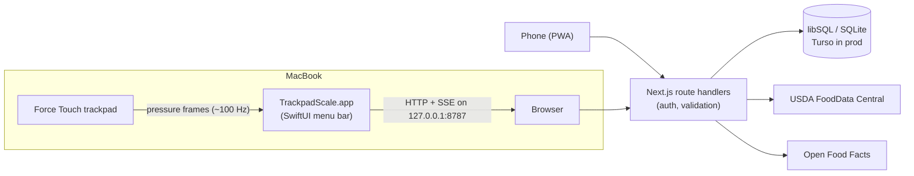

# Calories: a calorie tracker that weighs food on your MacBook trackpad

[](https://github.com/b-amit11/calorie-tracker/actions/workflows/ci.yml)

A full-stack nutrition tracker with an unusual input device: the Force Touch trackpad. A native macOS menu-bar app reads raw trackpad pressure, turns it into a stable weight in grams, and streams it to the web app, so logging "how much" is a single click.

- **Web app:** Next.js 16, React 19, TypeScript, Tailwind, Drizzle ORM on libSQL/SQLite (Turso in production)
- **Mac app:** Swift 6, SwiftUI `MenuBarExtra`, Network.framework, private MultitouchSupport via OpenMultitouchSupport
- **Quality:** 76 Vitest tests (unit + route-level integration), 28 Swift tests (Swift Testing), GitHub Actions CI

## Features

| | |
| --- | --- |
| **Food diary** | Meals by day, calorie and macro totals against goals, edit/move/delete entries |
| **Food search** | USDA FoodData Central (whole foods) + Open Food Facts (packaged foods), with relevance re-ranking |
| **Barcode scanning** | Phone camera via the native `BarcodeDetector`, with a ZXing WebAssembly fallback for iOS Safari |
| **Trackpad scale** | Live weight in the add-food sheet; one click fills in the grams |
| **Offline logging** | Installable PWA; entries made offline are queued and replayed idempotently on reconnect |
| **Progress** | Body-weight trend and 30-day calorie chart |
| **Accounts** | Email/password auth, per-user data, and throwaway demo accounts with sample data |

## Architecture



```
calorie-tracker/
├── web/                     Next.js app
│   ├── app/                 pages + API route handlers
│   ├── lib/                 data access (repo.ts), auth, validation, food APIs, offline queue
│   ├── drizzle/             SQL migrations
│   └── test/                route-level integration tests
└── scale-helper/            Swift package
    ├── Sources/ScaleCore    weight estimation + HTTP routing (pure, unit-tested)
    ├── Sources/ScaleKit     trackpad input + loopback server
    ├── Sources/TrackpadScale  menu-bar app
    └── Sources/ScaleCLI     headless command-line version
```

The design decisions behind all this (signal processing, the security model, offline sync, caching the food catalog) are written up in [docs/DESIGN.md](docs/DESIGN.md).

## How the trackpad scale works

Force Touch trackpads measure pressure with strain gauges, but they only report it while a finger is touching the pad. So the user rests one finger on the pad and the finger's pressure becomes part of the tare:

1. **Smoothing:** median of a sliding window (~0.4 s), which ignores single-frame spikes.
2. **Stability:** the window's spread must stay under a threshold before a reading counts as "stable".
3. **Auto-tare:** 0.6 s after a finger lands, once the signal is stable, the current value becomes zero.
4. **Calibration:** place a known weight (coins work), and the app stores a correction factor.

All of this lives in `ScaleCore.WeightEstimator`, a pure value type tested with synthetic signals.

## Running locally

Requirements: macOS 15+ with a Force Touch trackpad, Node.js 22.12+, Swift 6.2+ (Xcode 26 or Command Line Tools).

```bash
# Web app: http://localhost:3000 (creates a local SQLite file on first run)
cd web && npm install && npm run dev

# Menu-bar scale app
cd scale-helper && scripts/build-app.sh --install && open /Applications/TrackpadScale.app
# or headless: swift run trackpad-scale
```

### Tests

```bash
cd web && npm test && npm run typecheck
cd scale-helper && scripts/test.sh    # or `swift test` with full Xcode
```

## Deploying

The web app runs on any Node host. The reference setup is **Vercel** with a **Turso** database:

1. Create a database: `turso db create calories`, then get its URL and a token (`turso db tokens create calories`).
2. Import the repo in Vercel and set **Root Directory** to `web`.
3. Add environment variables: `DATABASE_URL`, `DATABASE_AUTH_TOKEN`, and optionally `USDA_API_KEY`, `ALLOW_SIGNUP`, `DEMO_ENABLED` (see [`web/.env.example`](web/.env.example)).
4. Deploy. Migrations run automatically on the first request.

To use the trackpad scale with the deployed site, add its URL under **Trackpad Scale → Settings → Websites allowed to read the scale**.

## Limitations

- MultitouchSupport is a private Apple framework, so a macOS update could break the scale. The app can't ship on the Mac App Store.
- The scale is accurate to a few grams for small loads. It isn't a replacement for a kitchen scale.
- The Mac app is ad-hoc signed. Distributing it would require a Developer ID and notarization.

## Credits

Trackpad access: [OpenMultitouchSupport](https://github.com/Kyome22/OpenMultitouchSupport). Using the trackpad as a scale was inspired by [TrackWeight](https://github.com/KrishKrosh/TrackWeight). Food data: [USDA FoodData Central](https://fdc.nal.usda.gov) and [Open Food Facts](https://world.openfoodfacts.org) (ODbL).
